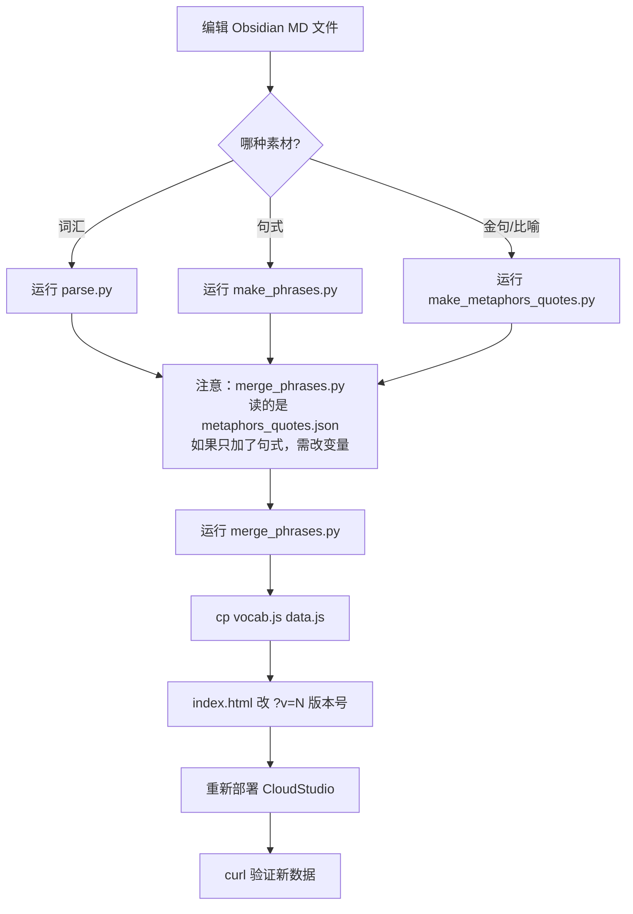

# 高频词汇打卡网页 — 建站与维护方法指南

> ⛔ **本副本已废弃（2026-07-23）。唯一权威版本在 `D:\vibe-coding-hua\建站方法指南.md`，请只更新那一份。**

> **目标**：基于 Obsidian 写作素材（词汇/句式/金句/比喻/规则），建立"运用一次打卡一次"的记忆系统。
> 手机优先排版，本地 + 云端双重存储，所有设备自动同步。

---

## 一、整体架构

```
┌──────────────┐     ┌──────────────┐     ┌──────────────┐
│  Obsidian MD  │ ──→ │  Python 解析  │ ──→ │  data.js      │
│  素材文件      │     │  build/ 脚本  │     │  (前端数据)    │
└──────────────┘     └──────────────┘     └──────┬───────┘
                                                  │
┌──────────────┐     ┌──────────────┐            │
│  CloudStudio   │ ←── │  index.html   │ ←────────┘
│  部署 (免运维)  │     │  + app.js     │
│                │     │  + styles.css  │
└──────┬───────┘     └──────┬───────┘
       │                     │
       ▼                     ▼
┌──────────────┐     ┌──────────────┐
│ 浏览器 localStorage │     │  Supabase 云端  │
│ (本地离线数据)   │     │ (多设备同步)    │
└──────────────┘     └──────────────┘
```

**关键设计决策**：
- 纯静态网页（HTML/CSS/JS），无框架，无构建步骤
- 数据双层存储：localStorage（本地） + Supabase REST API（云端）
- 部署在 CloudStudio，链接固定，沙盒休眠后需重新激活
- 分类→Tab 的归属判断在 `app.js` 的 `TABS.match` 函数中，用 emoji 前缀或正则判定

---

## 二、项目文件地图

所有文件均在 `C:\Users\Lenovo\WorkBuddy\2026-07-21-16-55-18\vocab-checkin\` 下：

| 文件 | 说明 | 修改频率 |
|------|------|---------|
| `index.html` | 主页面（侧栏 + toolbar + 设置弹层） | 极少（加新 Tab 时） |
| `styles.css` | 全部样式，米色+金棕知识库风 | 极少 |
| `app.js` | 核心 JS（打卡/渲染/Supabase同步/Tab分类） | **更新数据后要改版本号** |
| `data.js` | **词条数据**（window.VOCAB + window.CATEGORIES） | **每次新增内容必改** |
| `build/parse.py` | 词汇解析器：解析 002-高频词汇库.md → vocab.js | 词汇更新时用 |
| `build/make_phrases.py` | 句式解析器：解析 005-句式工具箱.md → phrases.json | 句式更新时用 |
| `build/make_metaphors_quotes.py` | 金句/比喻解析器：解析 003/004 → metaphors_quotes.json | 金句/比喻更新时用 |
| `build/merge_phrases.py` | 合并器：将 phrases.json / metaphors_quotes.json 合并到 vocab.js | 每次新增后必用 |
| `build/make_dbt.py` | 腾讯多维表格建表参数生成器（已弃用，网页版为主） | 不用 |
| `build/make_xlsx.py` | Excel 导出（辅助） | 不用 |
| `build/make_tdoc.py` | 腾讯文档导入脚本（已弃用） | 不用 |
| `build/cleanup.py` | 腾讯文档空记录清理 | 不用 |
| `supabase-schema.sql` | Supabase 建表脚本（仅首次执行） | 不改 |
| `README.md` | 旧说明（过时） | 忽略 |
| `README-腾讯多维表格.md` | 腾讯多维表格版说明 | 参考 |
| `Supabase原理讲解.md` | Supabase 原理 | 参考 |

---

## 三、词条数据格式（data.js）

`data.js` 定义了 2 个全局变量：

### window.VOCAB

```js
[
  {
    "id": 1,          // 唯一 ID，**不能重复**，一旦分配不得改变（与 Supabase 打卡记录关联）
    "cat": "01-观点与论述",  // 分类名，决定词条归属哪个 Tab
    "word": "堪称",         // 主词/标题（列表页显示）
    "syn": "称得上、算是",   // 同义词/口语化表达
    "mean": "称得上、算是",  // 释义
    "example": "评级机构…",  // 例句
    "scene": "用于…评价"     // 使用场景
  },
  // ...
]
```

### window.CATEGORIES

```js
["01-观点与论述", "02-逻辑关系", …, "📖 写作基础知识", "🚀 文章开篇类", …, "💎 📈 投资理念", …, "🎨 ⚠️ 风险与警示", …]
```

分类名前面的 **emoji 前缀**控制了 Tab 归属：
- **无 emoji** → 词汇（📚）
- **有 emoji 但不以 💎/🎨/📖 开头** → 句式（✍️）
- **以 💎 开头** → 金句（💎）
- **以 🎨 开头** → 比喻（🎨）
- **以 📖 开头** → 规则（📐）

> ⚠️ **ID 不可变**：打卡数据存在 Supabase 时按 `id` 关联。一旦某个词条被分配了 id=731，就不能再改——否则云端打卡记录会对应到错词。追加新词时 id 必须从 max(id)+1 起。

---

## 四、Tabs 定义与分类逻辑（app.js 关键代码）

```js
const TABS = [
  { id: 'vocab', name: '词汇', icon: '📚', match: c => !/[\u{1F300}-\u{1FAFF}\u{2600}-\u{27BF}]/u.test(c) },
  { id: 'phr',   name: '句式', icon: '✍️', match: c => /[\u{1F300}-\u{1FAFF}\u{2600}-\u{27BF}]/u.test(c) && !/^[💎🎨📖]/u.test(c) },
  { id: 'quote', name: '金句', icon: '💎', match: c => c.indexOf('💎') === 0 },
  { id: 'met',   name: '比喻', icon: '🎨', match: c => c.indexOf('🎨') === 0 },
  { id: 'rule',  name: '规则', icon: '📐', match: c => c.indexOf('📖') === 0 },
];

// 分类 → Tab 映射函数
function tabOf(cat) {
  for (const t of TABS) if (t.match(cat)) return t.id;
  return 'vocab';
}
```

**分类判定优先级**（从上到下）：
1. 以 💎 开头 → 💎 金句
2. 以 🎨 开头 → 🎨 比喻
3. 以 📖 开头 → 📐 规则
4. 含 emoji 但不匹配以上 → ✍️ 句式
5. 无 emoji → 📚 词汇

> ⚠️ **⚠️ 致命陷阱：emoji 正则必须加 `u` flag！**（见下文第六节）

---

## 五、分类与 Emoji 前缀规则表

| 数据来源 | 分类名示例 | Emoji 前缀 | Tab 归属 |
|---------|-----------|-----------|---------|
| 高频词汇库 | 01-观点与论述 | 无 | 📚 词汇 |
| 句式工具箱 | 🚀 文章开篇类 | 🚀📊⚖️📋🔄🎯✨📈💼 | ✍️ 句式 |
| 金句调用地图 | 💎 📈 投资理念 | 💎 | 💎 金句 |
| 比喻调用地图 | 🎨 ⚠️ 风险与警示 | 🎨 | 🎨 比喻 |
| 写作基础知识 | 📖 写作基础知识 | 📖 | 📐 规则 |

**新增 Tab 的规则**：
- 给分类名配一个**独特的 emoji 前缀**（不要与其他 Tab 冲突）
- 在 `TABS` 数组中新增一项
- 确保 `phr` 的 `match` 正则排除这个新 emoji

---

## 六、频发 Bug 大全 ⚠️

### Bug 1：emoji 正则无 `u` flag（**最致命**）

```
// ❌ 错误写法（7个句式分类会归到词汇）
/^[💎🎨📖]/.test(c)

// ✅ 正确写法（加 u flag）
/^[💎🎨📖]/u.test(c)
```

**原因**：每个 emoji 是 2 个 UTF-16 code unit（surrogate pair）。无 `u` flag 时，字符类 `[💎🎨📖]` 把 surrogate pair 的第一个单元 `\uD83D` 当作单字符匹配——而**几乎所有 emoji**（🚀📊📋🔄🎯📈💼📖💎🎨…）都以 `\uD83D` 开头。后果：
- 🚀📊📋🔄🎯📈💼 开头的 7 个句式分类会**全部被判定为不含 emoji**，误归词汇
- 句式 Tab 下只剩 ⚖️（U+2696）和 ✨（U+2728）两个分类
- 这就是用户报"句式只剩两个"的根因

**教训**：JS 正则处理 emoji/多字节字符**必须加 `u` flag**。

### Bug 2：CATEGORIES 重复追加

**场景**：`merge_phrases.py` 被重复运行 → 同一批分类被多次追加 → 多个空分类出现在侧栏。

**修复**：合并脚本已有去重逻辑（`if c not in cats: cats.append(c)`），但注意排查 history。

### Bug 3：列映射关键字优先级（解析句式文件时）

**场景**：表列不统一（3/4/5 列混用）。5 列表 "序号|句式名称|句式结构|例句|适用场景" 中，word 可能取成"句式名称"（列1）而非"句式结构"（列2）。

**修复**：按关键字优先级遍历——**外层 for 关键字、内层 for 列**。见 `make_phrases.py` 的 `col_map()` 函数：
```python
word = find(['句式结构', '模板', '句式名称', '主题'])
syn = find(['句式名称', '模板', '主题'], skip=word)
```

### Bug 4：浏览器顽固缓存

**场景**：修改了 data.js 或 app.js 后，浏览器仍显示旧版本。

**修复**（三选一，推荐方法3）：
1. **最彻底**：把 vocab.js 改名 data.js（彻底绕过缓存，因为它们会缓存文件名）
2. **变更版本号**：在 `index.html` 的 `script` 引用加 `?v=N`（N 递增），如 `<script src="data.js?v=7">`
3. **用户浏览器**：打开 DevTools → Network → 勾选 Disable Cache → 强制刷新

### Bug 5：id 重排破坏云端打卡数据

**场景**：去重后 id 重排 → 已打卡的 id 对应到错误的词条。

**修复**：追加新词条时 id 始终从 max(id)+1 起，**绝不回退重排**。如果不小心破坏了，可以从 Supabase 导出打卡记录、对照旧 data.js 恢复。

### Bug 6：navigator.vibrate 在 iOS 不支持

**代码**：
```js
try { if (navigator.vibrate) navigator.vibrate(15); } catch (e) {}
```
`navigator.vibrate` 必须 try/catch，iOS Safari 不支持会抛 TypeError。

---

## 七、新增词汇/句式/金句/比喻的标准流程

### 场景 A：新增词汇（修改 002-高频词汇库.md）

1. 在 Obsidian 中编辑 `002-高频词汇库.md`
2. 运行解析脚本：
   ```bash
   python C:\...\vocab-checkin\build\parse.py
   ```
   输出 → `vocab-checkin\vocab.js`（覆盖写）

### 场景 B：新增句式（修改 005-句式工具箱.md）

1. 在 Obsidian 中编辑 `005-句式工具箱.md`
2. 运行解析脚本：
   ```bash
   python C:\...\vocab-checkin\build\make_phrases.py
   ```
   输出 → `vocab-checkin\build\phrases.json`

### 场景 C：新增金句或比喻（修改 003/004-*.md）

1. 在 Obsidian 中编辑 `003-金句调用地图.md` 或 `004-比喻调用地图.md`
2. 运行解析脚本：
   ```bash
   python C:\...\vocab-checkin\build\make_metaphors_quotes.py
   ```
   输出 → `vocab-checkin\build\metaphors_quotes.json`

### 合并（场景 A/B/C 任意一种后必做）

3. **注意**：`merge_phrases.py` 实际上是通用的合并器，它读的是 `metaphors_quotes.json`。所以：
   - 场景 B 后：需要手动把 `phrases.json` 复制为 `metaphors_quotes.json`（或修改 merge_phrases.py 的变量指向 phrases.json）
   - 场景 C 后：直接运行即可

   运行合并脚本：
   ```bash
   python C:\...\vocab-checkin\build\merge_phrases.py
   ```
   输出 → 更新 `vocab-checkin\vocab.js`（追加 id 从 max+1 起，新分类去重追加到末尾）

4. 将 `vocab.js` 复制为 `data.js`：
   ```bash
   cp vocab.js data.js
   ```

5. 如果新增了**全新的分类（新 emoji 前缀）**，还需检查 `app.js` 的 `TABS` 数组是否需加新 Tab（通常不需要，现有的 emoji 正则覆盖即可）

### 部署

6. 修改 `index.html` 中 script 引用的版本号（`?v=N` → `?v=N+1`）
7. 用 `workbuddy_cloudstudio_deploy` 重新部署到 CloudStudio

### 快速验证

```bash
# 验证部署后的 data.js 是新版本
curl -s https://996d3bb65bf24b66b3d2f30f5fdb9e53.app.codebuddy.work/data.js \
  | head -c 200
```

---

## 八、解析脚本明细对照

| 脚本 | 输入源 | 输出 | 关键字段映射 |
|------|-------|------|-------------|
| `parse.py` | `002-高频词汇库.md`（5 列表格，首列加粗） | `vocab.js` | 表列顺序：word/syn/mean/example/scene |
| `make_phrases.py` | `005-句式工具箱.md`（表格列不统一） | `phrases.json` | 关键字优先级：word=句式结构>模板>句式名称>主题 |
| `make_metaphors_quotes.py` | `003-金句调用地图.md` + `004-比喻调用地图.md`（3 列表 #/场景/句子） | `metaphors_quotes.json` | word=场景、syn=编号、example=句子 |
| `merge_phrases.py` | 现有 vocab.js + metaphors_quotes.json | 更新 vocab.js | id 从 max+1 起，字段统一为 mean |

**特别说明**：
- 金句/比喻文件的表头首列是 `#`（井号），代码会将其归一化为"编号"再匹配（`make_metaphors_quotes.py` 第 29-30 行）
- `merge_phrases.py` 读的是 `metaphors_quotes.json`（第 6 行），如果只加了句式，需要手动改变量指向 `phrases.json`

---

## 九、部署流程

### 首次部署

用 WorkBuddy 的 `workbuddy_cloudstudio_deploy` 工具：
```
工具：workbuddy_cloudstudio_deploy
参数：
  directory: "C:\Users\Lenovo\WorkBuddy\2026-07-21-16-55-18\vocab-checkin"
  entry: "index.html"
  port: 3000
```
部署成功后会返回链接，例如：
`https://996d3bb65bf24b66b3d2f30f5fdb9e53.app.codebuddy.work`

### 重新部署（更新内容后）

同首次部署流程。CloudStudio 会创建新的沙盒并上传文件。

### 沙盒休眠后激活

CloudStudio 沙盒一段时间无人访问会休眠，显示 "工作空间未在运行"。此时只需重新调用 `workbuddy_cloudstudio_deploy` 即可激活。

---

## 十、Supabase 同步配置

### 建表（只需执行一次）

在 Supabase 控制台（https://supabase.com/dashboard/project/buzfmugezbemyfdmbgyt/sql/new）执行 `supabase-schema.sql`：

```sql
create table if not exists checkin (
  id          integer     primary key,
  count       integer     not null default 0,
  first_used  timestamptz,
  last_used   timestamptz,
  mastery     text        not null default '未用'
);

alter table checkin enable row level security;

create policy "anon_all"
  on checkin for all
  to anon
  using (true)
  with check (true);
```

### 凭据（已写死进 app.js）

```
Supabase URL: https://buzfmugezbemyfdmbgyt.supabase.co
Publishable Key: sb_publishable_HvD6YPPY-RpHLRicuoobSw_aSw1B_Ow
```

新版 Supabase 的 publishable key（`sb_publishable_...`）兼容旧版 `anon` role，与 RLS 策略 `to anon` 配合工作。

### 同步原理

- **写**：每次点击打卡 → `syncPush(id)` → REST POST `/rest/v1/checkin`（upsert）
- **读**：页面启动 → `syncPull()` → REST GET `/rest/v1/checkin?select=*`
- **冲突策略**：以 `last_used` 较新者为准

---

## 十一、数据追加 vs 重排的黄金规则

| 场景 | 做法 | ID 策略 |
|------|------|---------|
| 新增词汇/句式/金句/比喻 | 合并脚本自动追加 | max(id)+1 递增 |
| 删除某个词条 | 不要删，可以标记或跳过渲染 | 保留 id，不回收 |
| 修改某个词条的 word/cat | 直接改 data.js 对应字段 | 保持 id 不变 |
| 重排所有 id（不推荐） | ❌ **绝对不做** | 破坏云端打卡记录 |

**核心原因**：打卡数据在 Supabase 中用 `id` 做外键。id 变了，云端数据就对应到错误的词条。

---

## 十二、快速参考清单（更新全流程）



**必须在脑中检查的事项**：
- [ ] 新分类的 emoji 前缀是否与现有 Tab 匹配规则一致？
- [ ] 如果是新 emoji，`TABS` 的 `phr.match` 正则是否排除它？
- [ ] `merge_phrases.py` 读的是正确的 JSON 文件吗？
- [ ] `app.js` 中所有 emoji 相关的正则都加了 **`u` flag** 吗？
- [ ] `index.html` 版本号已递增？
- [ ] 旧 `data.js` 已覆盖为新版本？

---

## 十三、当前系统状态快照（截至 2026-07-22）

| 维度 | 值 |
|------|-----|
| 总词条 | 1134 条 |
| 分类数 | 31 个 |
| Tab 数 | 5 个（词汇/句式/金句/比喻/规则） |
| Supabase 表 | `checkin` 已建，RLS 已配 |
| 部署链接 | https://996d3bb65bf24b66b3d2f30f5fdb9e53.app.codebuddy.work |
| 数据文件 | `data.js`（版本化：当前 ?v=6） |
| JS 文件 | `app.js`（版本化：当前 ?v=6） |
| 风格 | 米色 #f5f0e6 + 金棕 #b8861b，左侧深色侧栏 #1f1d1a |
